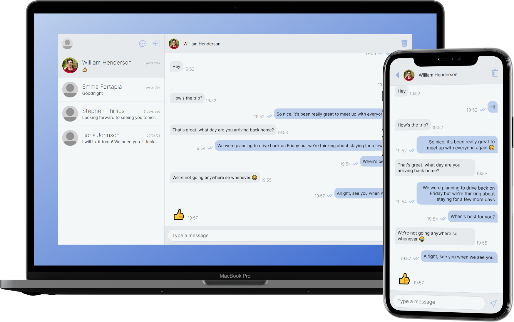

 

      
    
    
    

# Communicate
Communicate a simple and intuitive chat app, providing an easy way to stay in touch with friends, family and anyone else. It has a modern and stylish interface, a reliable and secure Google-provided back-end, and is built using the latest web technologies. Whether you're planning a trip with your friends, or organising a project with your colleagues, Communicate connects you together to help you get stuff done. You can use Communicate now at [communicate.ga](https://communicate.ga).

## Features
Communicate offers everything you need to keep in touch, including:
- Instant communication across the world
- Intuitive, stylish, and easy-to-use interface
- Google-backed security keeping all your data private
- Available in a web browser or as an app on a wide range of devices

## Tech Stack
### Frontend
- [React](https://reactjs.org/) JavaScript framework
- [Bootstrap Icons](https://icons.getbootstrap.com/) because they're nicer than the Material Design ones
- [Sass](https://sass-lang.com/) for styling

### Backend
- [Firebase Realtime Database](https://firebase.google.com/docs/database) for literally everything
- [Netlify](https://www.netlify.com/) for hosting
